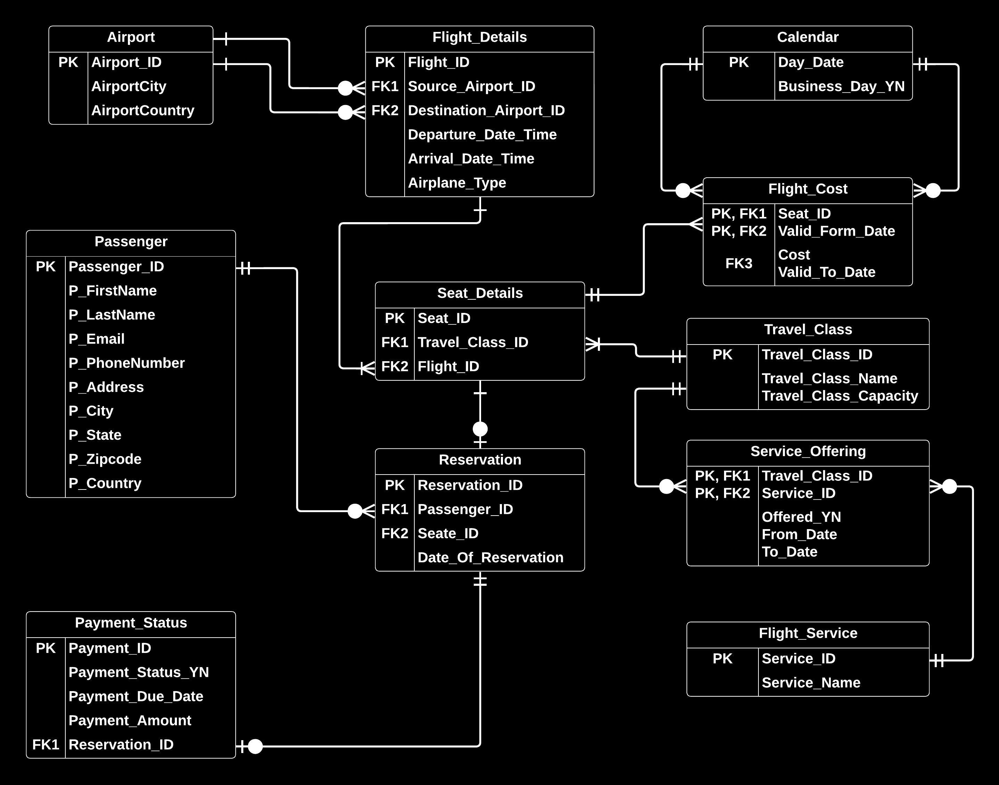

## 1. Introduction

### 1.1 Overview

The Flight Booking System (FBS) is a database designed to manage flight
reservations in a secure and efficient manner. Its objectives are to keep track
of and securely store booking records, enable easy retrieval of booking
information, prevent data loss and ensure data integrity, reduce data entry
errors, restrict access to authorized users, eliminate duplication, and reduce
paperwork. The FBS provides consumers with a user-friendly interface to search
and book flights, check tickets and reservations, view ticket prices, and access
data on multiple flights. It is a centralized database that stores information
on the source, destination, and layovers of flights, as well as other relevant
data to plan a trip. The FBS can manage a large amount of data and scale to
accommodate multiple flights.

### 1.2 Purpose

The main purpose of the Flight Booking System (FBS) is to streamline the flight
reservation process by minimizing paperwork while providing customers with an
easy and efficient way to book and manage their flights. The FBS stores and
manages a vast amount of data related to multiple flights, making it easier for
airlines to manage bookings, flight schedules, and ticket prices. It provides
customers with a user-friendly interface to search and book flights, check
tickets and reservations, and access relevant flight information. The FBS aims
to enhance the efficiency of flight reservations by reducing duplication,
minimizing data entry errors, and ensuring data integrity.

## 2. Design

### 2.1 Entities

- Airport
- Passenger
- Flight_Details
- Flight_Service
- Seat_Details
- Flight_Cost
- Reservation
- Travel_Class
- Calendar
- Payment
- Payment_Status
- Service_Offering

### 2.2 ERD

  

### 2.3 Files

### <ins>flight_booking_database</ins>

This SQL script creates a database named FBS and several tables with their
respective primary keys, constraints, and foreign keys. The tables are related
to an airline reservation system and include tables for airports, passengers,
travel classes, flight details, seat details, reservations, payment status,
flight costs, service offerings, and calendar. Additionally, the script creates
unique and non-clustered indexes for each table.

### <ins>payment_and_cost_triggers.sql</ins>

Contains two triggers related to payment and cost calculation for the Flight
Booking System database.

### <ins>stored_procedures.sql</ins>

Contains multiple stored procedures related to different functionalities of the
Flight Booking System database, including flight availability, flight details
update, passenger CRUD operations, and payment update.

## 3. Future Work

- Insert data.

(<a href="#top">back to top</a>)

<!-- CONTACT -->
## 4. Contact

Erol Gelbul - [Website](http://www.erolgelbul.com)

Project Link: [Flight Booking System](https://github.com/ErolGelbul/flight_booking_system)

(<a href="#top">back to top</a>)
